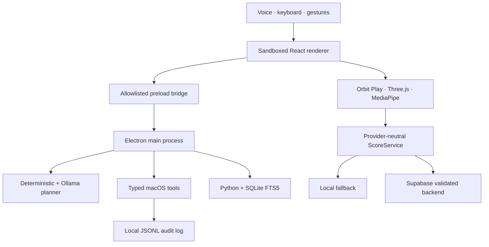
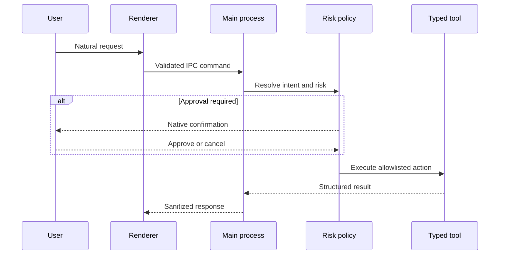
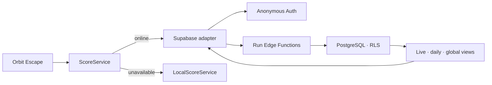

# Orbit

### A local-first AI desktop agent for macOS—combining voice interaction, permission-scoped automation, private knowledge retrieval, spatial computing, and competitive 3D gameplay.

Orbit turns natural-language and gesture input into safe, visible, auditable actions. Its core assistant runs locally with Ollama, privileged operations pass through typed Electron IPC boundaries, and potentially destructive actions require explicit confirmation. Orbit Play extends the same local-first philosophy to camera-based hand tracking, a navigable 3D universe, and Orbit Escape: a deterministic endless runner with secure online leaderboards and an offline fallback.

> **Project status:** Active development · macOS-first · current package version `0.11.0`

## Why Orbit

Most desktop agents optimize for broad autonomy. Orbit is designed around controlled agency:

- **Local intelligence:** Ollama and `qwen3:4b` handle planning without per-request cloud AI charges.
- **Typed execution:** the model selects reviewed intents; it cannot run arbitrary shell commands.
- **Least privilege:** Electron uses a sandboxed renderer, context isolation, and an allowlisted preload bridge.
- **Recoverable actions:** cleanup moves approved files to Trash instead of permanently deleting them.
- **Auditable behavior:** privileged tool calls record risk, status, timestamp, and a human-readable summary.
- **Graceful degradation:** deterministic planners and local score storage preserve core experiences when optional services are unavailable.

## Experiences

| Experience | What it demonstrates | Status |
|---|---|---|
| **Orbit Assistant** | Voice-first command routing, native macOS context, local reasoning, typed tools, and spoken responses | Implemented |
| **Local Knowledge** | User-approved folder indexing and cited retrieval with Python and SQLite FTS5 | Implemented |
| **Safe Desktop Automation** | System diagnostics, recent-work recovery, repository context, app launch, browser actions, and recoverable cleanup | Implemented |
| **Orbit Universe** | React Three Fiber solar-system navigation controlled by keyboard and locally processed hand gestures | Implemented |
| **Orbit Escape** | Deterministic 3D endless runner with lane steering, phase dash, scoring, daily seeds, and keyboard/camera input | Implemented |
| **Competitive Leaderboards** | Anonymous identity, server-validated run lifecycle, live/daily/global boards, and offline fallback | Implemented on `main` |
| **Energy Lab / Orbit Gauntlet** | Camera-first energy interaction, deliberate fist activation, three-second retraction, and controlled palm blast | Phase 12 foundation on `main` |

## System architecture



The renderer runs with `nodeIntegration: false`, `contextIsolation: true`, and `sandbox: true`. It never receives a general shell, filesystem, or privileged Supabase service client.

## Safe tool execution



The model proposes a typed intent; policy—not model output—determines whether and how an action can run. Sensitive or destructive operations remain approval-gated, and cleanup is both selection-gated and confirmed by the native process.

## Orbit Escape

Orbit Escape is rendered interactively with React Three Fiber and Three.js. The player steers a ship across three lanes, collects multiplier rings, manages phase energy, and phase-dashes through unavoidable hazards. Keyboard controls work without a camera; optional hand tracking adds smoothed lane control, hysteresis, short tracking-loss tolerance, and pinch-triggered dash input.

Core engineering details:

- Seeded procedural obstacle generation with deterministic daily challenges
- Gameplay rules that preserve a clear lane unless a section explicitly requires phase dash
- Score, distance, energy, multiplier, combo, and near-miss systems
- Object-oriented 3D scene components, lighting, particles, post-processing, and camera motion
- Persistent personal best and instant restart
- Regression coverage for deterministic generation, dash-section fairness, lane hysteresis, overlay behavior, and score services

Controls:

| Action | Keyboard | Gesture |
|---|---|---|
| Move left/right | `A` / `D` or arrow keys | Move hand across stable lane thresholds |
| Phase dash | `Space` | Pinch |
| Restart | `Enter` | On-screen control |
| Stop Orbit Play | `Esc` | Hold both fists |

## Competitive scoring architecture



Every authoritative score mutation uses one of four protected operations: `start-run`, `submit-checkpoint`, `finish-run`, or `abandon-run`. Clients cannot directly write `active_runs` or finalized `runs`. Server-issued UTC seeds, checkpoint rate limits, monotonic score/distance rules, rules-version checks, and growth bounds provide a practical first anti-cheat layer. Daily and global boards expose only each player's best validated run.

If authentication, networking, or the backend fails, Orbit Escape switches to `LocalScoreService`; local results remain local and the game remains playable.

## Local AI and privacy

- Camera frames are processed locally by MediaPipe and are never intentionally recorded, stored, or uploaded.
- Approved knowledge folders are indexed locally with SQLite FTS5.
- Ollama inference stays on the user's Mac.
- The renderer has no direct Node.js or filesystem access.
- The Supabase publishable key is public configuration; the privileged `service_role` key is never bundled in Orbit.
- Email addresses and private authentication metadata are not displayed on leaderboards.
- Optional cloud-backed features are isolated from core local tools and degrade safely when unavailable.

## Technology

| Layer | Technologies |
|---|---|
| Desktop | Electron, TypeScript, React, Vite |
| Local intelligence | Ollama, `qwen3:4b`, deterministic intent planner |
| Native macOS | Swift speech recognition, native TTS, scoped gesture helper |
| Spatial experiences | Three.js, React Three Fiber, Drei, postprocessing, MediaPipe Hands |
| Retrieval | Python, SQLite FTS5 |
| Competitive backend | Supabase Auth, PostgreSQL, Row Level Security, Edge Functions |
| Quality | Node test runner, Python `unittest`, Playwright overlay regression test, TypeScript checks |
| Distribution | electron-builder, hardened runtime, signing/notarization workflow |

## Development

### Prerequisites

- macOS for the complete native voice and gesture experience
- Node.js and npm
- Python 3 for the retrieval sidecar tests
- [Ollama](https://ollama.com/) with `qwen3:4b` for local AI

```bash
ollama pull qwen3:4b
npm install
npm run native:mac
npm run dev
```

The renderer and Electron processes start in development mode. macOS requests Camera, Microphone, and Speech Recognition permissions only when the related feature is used.

### Validation

```bash
npm run check
```

This runs both TypeScript checks, the Node test suite, Python sidecar tests, and the production build. The dedicated Playwright overlay regression can be run with:

```bash
npm run test:overlay
```

Create local packages with:

```bash
npm run dist
```

## Repository structure

```text
src/main/                         Electron lifecycle, policies, and privileged tools
src/preload/                      Narrow typed renderer bridge
src/renderer/                     React UI and Orbit Play
src/renderer/orbit-universe/      Three.js universe, gestures, and Orbit Escape
src/shared/                       Shared IPC and domain contracts
sidecar/                          Local Python retrieval engine
native/macos/                     Swift speech and gesture helpers
supabase/                         Leaderboard schema and protected run functions
tests/                            Policy, gameplay, scoring, and overlay regression tests
scripts/                          Build, packaging, signing, and artifact verification
```

## Roadmap

- Upgrade the Phase 12 camera-first Energy Lab with a palm-following, depth-aware energy sphere
- Replace the 2D gauntlet overlay with articulated 3D armor plates, stronger assembly animation, recoil, lighting, particles, and original mechanical audio
- Strengthen competitive identity beyond disposable anonymous accounts
- Add signed checkpoints or replay validation for stronger anti-cheat guarantees
- Expand semantic retrieval and reranking beyond the SQLite FTS5 baseline
- Add encrypted long-term memory, retention controls, and revocable folder grants
- Grow the agent evaluation and prompt-injection regression suite
- Complete public macOS signing, notarization, and release readiness

## Current limitations

- Orbit is macOS-first; some functionality is unavailable on other platforms.
- Local AI quality and latency depend on the user's hardware and installed Ollama model.
- Anonymous leaderboard identities are suitable for a prototype, not strong competitive account ownership.
- The current anti-cheat model rejects obviously invalid progression but is not fully authoritative simulation.
- Camera tracking quality varies with lighting, framing, and camera hardware; keyboard controls remain available.

## Author

Built by **Nikhil Kumar Thanda** as a flagship exploration of local AI orchestration, secure desktop agency, spatial interaction, and product-grade full-stack engineering.

## Disclaimer

Orbit is an independent AI-assisted personal project. It is not an Apple, OpenAI, Google, Supabase, or operating-system vendor product, and it is not represented as an unrestricted autonomous agent.

