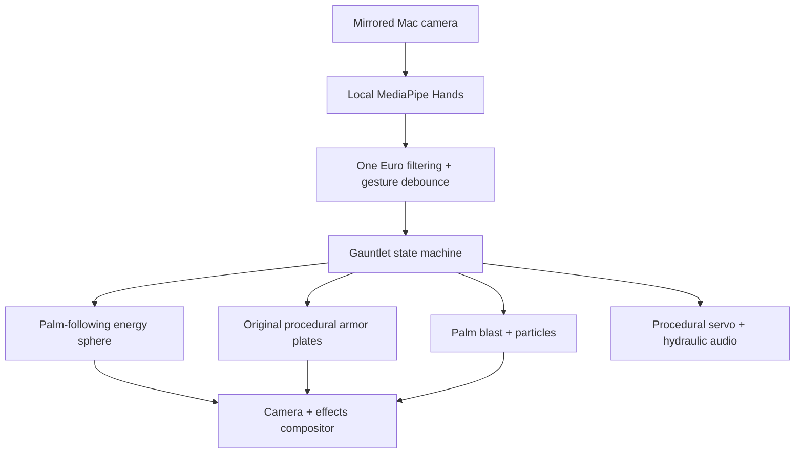
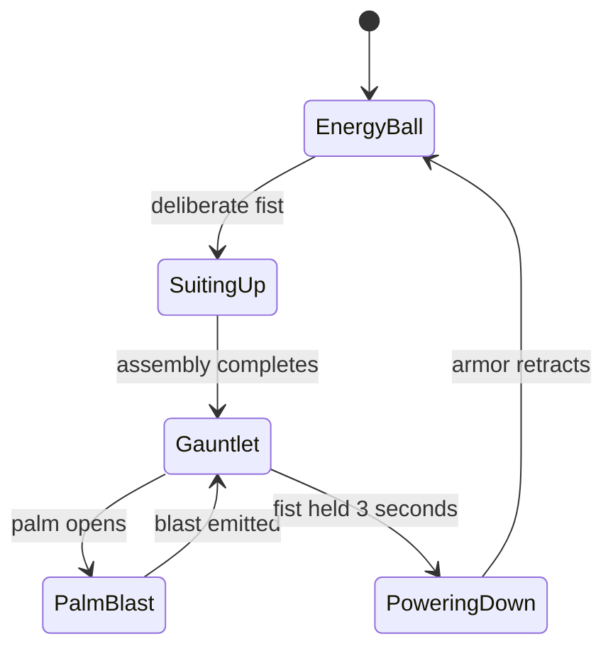

# Energy Lab / Orbit Gauntlet architecture

Energy Lab is a camera-first augmented-reality experience. The live video remains local; MediaPipe produces only stabilized hand landmarks for the effect engine.

## Safety and lifecycle

- Camera frames never leave the renderer and are not recorded or uploaded.
- No cloud inference or paid API is used.
- `Esc` and the existing two-fist emergency stop remain authoritative.
- Animation and camera tracks stop when Orbit Play exits.
- Film assets and sampled movie audio are not used; the gauntlet and sounds are original procedural work.

## Milestones

1. Reliable camera-first interaction and deterministic state transitions.
2. Palm-anchored energy sphere with depth-aware motion and occlusion.
3. 3D articulated gauntlet plates aligned to hand landmarks.
4. Charged palm blast, recoil, lighting, particles, and screen-space impact.
5. Performance profiling, visual regression coverage, and Mac hardware polish.
